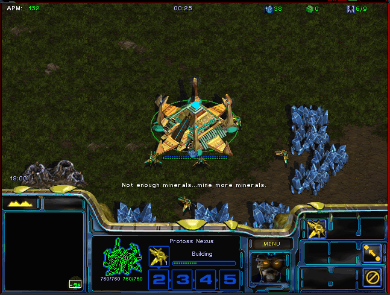
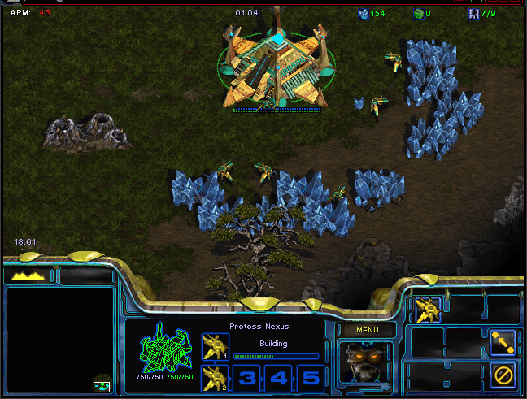

# note

+ Translate the delphi version Chaoslauncher plugin apmalert.bwl into C++.
+ Only works in debug mode by now. 
+ It will crash when compile release version, I didn't find out why.

delphi Version from [tec27](https://github.com/tec27/APMAlert)
some C++ code from [tec27](https://github.com/tec27/ObsGraph)
thanks tec27

# 说明

将delphi版本的bwl插件翻译成VC版本

使用方法: 将生成的apmalert.bwl 放在Chaoslauncher目录, 在Chaoslauncher中启用插件后，运行游戏即可

# 功能

* 在指定位置(默认上方)显示游戏时钟
* 在指定位置(默认左下方)显示系统时钟
* 显示实时APM

# 进度

+ 当前可以在debug下运行，release下会闪退，原因未知

# 截图

